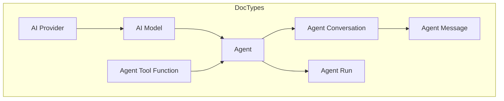

# Frappeverse AI Ecosystem Research

> Comprehensive analysis of open-source AI/ML apps in the Frappe ecosystem to inform OwlAI development.

---

## Executive Summary

| App | Stars | Status | Key Value | Complexity |
|-----|-------|--------|-----------|------------|
| **Huf** | 200+ | Active | Full agent framework with 500+ models | High |
| **Otto** | Internal | Early | Session management, library-first | Medium |
| **Frappe MCP** | 100+ | Active | MCP server protocol | Low |
| **Frappe Assistant Core** | 200+ | Active | 21 tools, plugin system | High |
| **Raven** | 2k+ | Mature | Real-time chat + AI agents | Very High |

---

## 1. Huf (tridz-dev/huf)

**Repository**: https://github.com/tridz-dev/huf  
**Documentation**: https://docs.huf.ai

### Architecture



### Key Features We Can Adopt

1. **Conversation DocType Schema**
   - `Agent Conversation` tracks full interaction history
   - `Agent Message` stores role (user/assistant/system), content, tool calls
   - `Agent Run` logs each execution with token usage, cost

2. **Tool System**
   - `Agent Tool Function` doctype for custom actions
   - SDK-based tool serialization for AI providers
   - Built-in tools: `get_list`, `get_document`, `create_document`, `update_document`

3. **Provider Abstraction**
   - Uses LiteLLM for 500+ model support
   - `AI Provider` and `AI Model` doctypes for config

### What We Skip

- Heavy configuration (multiple doctypes to set up)
- Complex trigger system (DocType events, schedules)
- Standalone agent console (we want inline assistant)

---

## 2. Otto (frappe/otto)

**Repository**: https://github.com/surajshetty3416/otto

### Key Strengths

1. **Session-Based Architecture**
   ```python
   session = otto.new(
       model=model,
       instruction="You are a helpful assistant",
       tools=[calculator_tool_schema]
   )
   session_id = session.id  # Persist for later
   
   # Load and resume
   session = otto.load(session_id)
   response = session.interact("What was the result?")
   ```

2. **Library-First Approach**
   - `otto.lib` can be imported in any Frappe app
   - Not tied to UI - can be used in background jobs

3. **Real Use Case**
   - Frappe Helpdesk first-response automation
   - 40% positive feedback rate

### What We Can Adopt

- Session ID pattern for conversation continuity
- Library module for reuse in other apps
- Model selection API (`otto.get_model(supports_vision=True)`)

---

## 3. Frappe MCP

**Repository**: https://github.com/frappe/mcp

### Purpose

Allows any Frappe app to function as an MCP (Model Context Protocol) server, exposing tools to external AI clients (Claude Desktop, etc.).

### How It Works

```python
# pip install frappe-mcp

from frappe_mcp import MCPServer

server = MCPServer()

@server.tool("get_customer")
def get_customer(name: str):
    return frappe.get_doc("Customer", name).as_dict()
```

### Future Integration

OwlAI could:
1. Use MCP protocol internally for tool execution
2. Expose itself as MCP server for Claude Desktop users
3. Connect to external MCP servers for extended capabilities

---

## 4. Frappe Assistant Core

**Repository**: https://github.com/buildswithpaul/Frappe_Assistant_Core

### Architecture Highlights

```
┌─────────────────────────────────────────┐
│           LLM Layer                      │
│  (Claude, GPT, Any MCP Client)          │
└─────────────┬───────────────────────────┘
              │ MCP Protocol (JSON-RPC 2.0)
┌─────────────▼───────────────────────────┐
│        Frappe Assistant Core             │
├──────────────────────────────────────────┤
│  Tool Registry (21 Built-in Tools)       │
├──────────────────────────────────────────┤
│  Plugin System                           │
│  - Core Plugin (always enabled)          │
│  - Data Science Plugin                   │
│  - Visualization Plugin                  │
│  - Custom Plugins                        │
├──────────────────────────────────────────┤
│  Security Layer (Auth + Permissions)     │
├──────────────────────────────────────────┤
│  Audit Trail (Logging)                   │
└─────────────┬───────────────────────────┘
              │
┌─────────────▼───────────────────────────┐
│        ERPNext/Frappe                    │
│  (Database, Docs, Reports, Workflows)   │
└─────────────────────────────────────────┘
```

### 21 Built-in Tools

| Category | Tools |
|----------|-------|
| Document CRUD | `create_document`, `get_document`, `update_document`, `delete_document`, `list_documents` |
| Search | `search`, `sql_query` |
| Reports | `run_report`, `get_report_builder` |
| Analytics | `aggregate`, `trends` |
| Execution | `run_python`, `run_script` |
| Visualization | `chart`, `export_csv` |

### Plugin Architecture

```python
class MyPlugin(PluginBase):
    name = "my_plugin"
    
    @tool("my_custom_action")
    def my_action(self, param: str):
        # Custom logic
        return {"result": "success"}
```

### What We Adopt

- Tool categorization pattern
- Security layer integration with Frappe permissions
- Audit trail for tracking AI interactions

---

## 5. Raven (The-Commit-Company/raven)

**Repository**: https://github.com/The-Commit-Company/raven

### Key Features

1. **Real-time Messaging**
   - WebSocket-based
   - Channels, DMs, threads

2. **AI Agents**
   - Built-in agent framework
   - Can automate tasks, extract data from files/images
   - "Execute complex, multistep processes with just a message"

3. **ERPNext Integration**
   - Share documents with customizable previews
   - Trigger notifications on document events
   - Workflow actions from chat

### Message Model

```javascript
{
  "channel": "channel_id",
  "user": "user_id",
  "content": "Message text",
  "type": "text|file|image|poll",
  "reactions": [{"emoji": "👍", "users": [...]}],
  "thread_messages": [...]
}
```

### What We Can Learn

- Rich message types (not just text)
- Reaction/interaction patterns
- Document sharing with live previews

---

## Gap Analysis

| Requirement | Huf | Otto | Frappe MCP | Assistant Core | Raven |
|-------------|-----|------|------------|----------------|-------|
| Zero config | ❌ | ⚠️ | ✅ | ❌ | ❌ |
| Native Frappe UI | ❌ | ❌ | N/A | ❌ | ✅ |
| Conversation memory | ✅ | ✅ | ❌ | ❌ | ✅ |
| Spotlight-style UX | ❌ | ❌ | ❌ | ❌ | ❌ |
| Button responses | ❌ | ❌ | ❌ | ❌ | ⚠️ |
| Role permissions | ✅ | ⚠️ | ⚠️ | ✅ | ✅ |
| Local LLM support | ✅ | ✅ | ❌ | ✅ | ❌ |

### OwlAI's Unique Position

**None of these apps offer a Spotlight-style, zero-config AI assistant that:**
1. Works immediately after installation
2. Integrates into existing Frappe navbar
3. Remembers conversation context per user
4. Shows interactive buttons/actions in responses
5. Uses Frappe's native permission system

---

## Recommended Borrowings

| From | What | Why |
|------|------|-----|
| Huf | `AgentMessage` schema | Proven pattern for message storage |
| Otto | Session library pattern | Clean API for conversation management |
| Frappe MCP | MCP protocol | Future extensibility |
| Frappe Assistant Core | Tool registry | Extensible action system |
| Raven | Message reactions | User feedback mechanism |

---

## Technical Decisions

### 1. Conversation Storage

**Decision**: Use Frappe DocTypes (not Redis/external DB)

**Rationale**:
- Native integration with Frappe permissions
- Automatic backup/restore
- User can view/delete conversations in Desk
- Works in all Frappe deployments

### 2. Message History Limit

**Decision**: Last 20 messages per conversation

**Rationale**:
- Keeps context window small (token efficiency)
- Sufficient for most multi-turn conversations
- Configurable via OwlAI Settings

### 3. UI Framework

**Decision**: Vanilla JS + CSS (no React/Vue)

**Rationale**:
- Matches Frappe's existing approach
- Smaller bundle size
- No build step required
- Works in all Frappe apps

### 4. Model Provider

**Decision**: Keep LiteLLM (already implemented)

**Rationale**:
- Proven by Huf (500+ models)
- Already in use in current OwlAI
- Supports Ollama for local LLMs

---

## References

- [Huf Documentation](https://docs.huf.ai)
- [Otto Library Docs](https://github.com/surajshetty3416/otto/blob/develop/otto/lib/docs/README.md)
- [Frappe MCP README](https://github.com/frappe/mcp)
- [Frappe Assistant Core Docs](https://github.com/buildswithpaul/Frappe_Assistant_Core)
- [Raven Website](https://ravenchat.ai)
